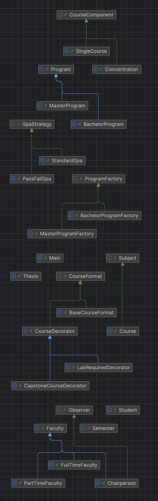

# MET CS665 Final Project - Academic Program Management System

## 👨‍🎓 Overview

This project simulates a university's Computer Science department system that manages:

- Undergraduate and Graduate programs
- Certificate programs
- Courses and concentrations
- Faculty (full-time, part-time, chairperson)
- Student enrollment, GPA, and thesis
- Waitlisting and notifications

It demonstrates a real-world object-oriented system using **six design patterns** from all three pattern categories:
creational, structural, and behavioral.

---

## 🧰 Technologies Used

- Java 21
- Gradle
- IntelliJ IDEA
- UML via draw.io

---

## 🧱 Project Structure




---

## 🧠 Design Patterns Implemented

### ✅ **Creational Patterns**

1. **Factory Method**
    - `ProgramFactory` creates `BachelorProgram` and `MasterProgram` objects
    - Promotes flexibility when adding new program types
2. **Singleton**
    - `Chairperson` class ensures only one instance exists system-wide

### ✅ **Structural Patterns**

3. **Composite**
    - `CourseComponent`, `SingleCourse`, and `Concentration`
    - Allows recursive concentration structures with nested courses
4. **Decorator**
    - `CourseFormat`, `BaseCourseFormat`, `CourseDecorator`, and decorators like `CapstoneCourseDecorator`
    - Adds metadata like "Capstone" or "Lab Required" without altering the core `Course` class

### ✅ **Behavioral Patterns**

5. **Observer**
    - `Course` (Subject) notifies `Chairperson` (Observer) when enrollment exceeds limit
6. **Strategy**
    - `GpaStrategy`, `StandardGpa`, `PassFailGpa` provide multiple GPA calculation methods

---

## 🧪 Features Demonstrated

- Creating and formatting programs and courses
- Decorating courses with features dynamically
- Organizing concentrations hierarchically
- Student enrollments with auto-waitlist handling
- GPA calculation via pluggable strategies
- Real-time notifications to the chairperson on course limits

---

## ▶️ How to Run

1. Download the project:
   ```bash
   cd cs665_finalProject_Ramirez
   run: ./gradlew run

### Author

**Pedro Ramirez**<br>
CS665 – Software Design & Patterns<br>
Boston University<br>
spring 2025

