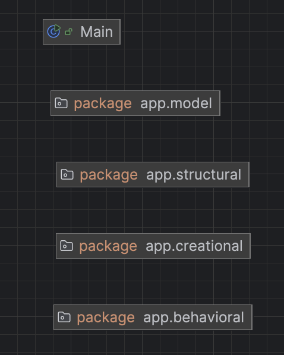

Here's your **updated full `README.md` file** with the Builder pattern added under *Creational Patterns*:

---

# MET CS665 Final Project - Academic Program Management System

## 👨‍🎓 Overview

This project simulates a university's Computer Science department system that manages:

- Undergraduate and Graduate programs
- Certificate programs
- Courses and concentrations
- Faculty (full-time, part-time, chairperson)
- Student enrollment, GPA, and thesis
- Waitlisting and notifications

It demonstrates a real-world object-oriented system using **six design patterns** from all three pattern categories:  
creational, structural, and behavioral.

---

## 🧰 Technologies Used

- Java 21
- Gradle
- IntelliJ IDEA
- UML via draw.io

---

## 🧱 Project Structure



---

## 🧠 Design Patterns Implemented

### ✅ **Creational Patterns**

1. **Factory Method**
    - `ProgramFactory` produces `BachelorProgram`, `MasterProgram`, and `CertificateProgram` objects
    - Promotes flexibility when adding new program types

2. **Singleton**
    - `Chairperson` class ensures only one instance exists throughout the system

3. **Builder**
    - `ThesisBuilder` constructs `Thesis` objects step by step
    - Useful for assembling complex thesis metadata (title, advisor, summary, keywords) in a readable and flexible way

---

### ✅ **Structural Patterns**

4. **Composite**
    - `CourseComponent`, `SingleCourse`, and `Concentration`
    - Allows recursive concentration structures with nested courses and sub-concentrations

5. **Decorator**
    - `CourseFormat`, `BaseCourseFormat`, `CourseDecorator`, and decorators like `CapstoneCourseDecorator` and
      `LabRequiredDecorator`
    - Adds metadata like "Capstone" or "Lab Required" without altering the core `Course` class

---

### ✅ **Behavioral Patterns**

6. **Observer**
    - `Course` (Subject) notifies `Chairperson` (Observer) when enrollment exceeds limit
    - Also supports real-time waitlist logic

7. **Strategy**
    - `GpaStrategy`, `StandardGpa`, and `PassFailGpa` provide multiple GPA calculation algorithms
    - Strategy objects can be swapped at runtime

---

## 🧪 Features Demonstrated

- Creating and formatting programs and courses
- Decorating courses with features dynamically
- Organizing concentrations hierarchically
- Student enrollments with auto-waitlist handling
- GPA calculation via pluggable strategies
- Real-time notifications to the chairperson on course limits
- Building complex `Thesis` objects using a fluent builder

---

## ▶️ How to Run

1. Download the project:
   ```bash
   cd cs665_finalProject_Ramirez
   ```

2. Run the app with Gradle:
   ```bash
   ./gradlew run
   ```

3. To run specific design pattern demos:
   ```bash
   ./gradlew :app:runCreational
   ./gradlew :app:runStructural
   ./gradlew :app:runBehavioral
   ```

---

### 👨‍💻 Author

**Pedro Ramirez**  
CS665 – Software Design & Patterns  
Boston University  
Spring 2025
